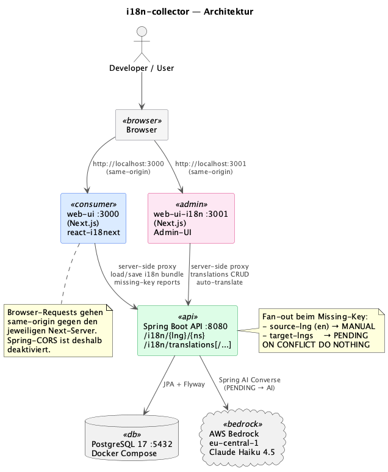

# i18n-collector

Monorepo für einen kleinen i18n-Stack: eine Konsumenten-Web-UI, eine getrennte
Admin-UI für die Übersetzungs-Tabelle und ein Spring-Boot-API, das die Daten
hält und Bedrock für AI-Übersetzungen anruft.

## Architektur



Quelle: [`material/architecture.plantuml`](material/architecture.plantuml) — neu rendern via `plantuml -tpng material/architecture.plantuml`.

### Komponenten

| Pfad                   | Zweck                                                                                                                     | Port |
| ---------------------- | ------------------------------------------------------------------------------------------------------------------------- | ---- |
| `projects/web-ui`      | Demo-/Konsumenten-App. Rendert `t(key, defaultValue)`-Strings über `react-i18next` und triggert Missing-Key-Reports.      | 3000 |
| `projects/web-ui-i18n` | Admin-UI auf der `translations`-Tabelle: Liste, Edit, Delete, Auto-Translate (Bedrock).                                   | 3001 |
| `projects/api`         | Spring-Boot-API mit JPA + Flyway-Migrationen. Endpoints für i18next-Backend (`/{lng}/{ns}`) und CRUD (`/translations/*`). | 8080 |
| `projects/e2e-tests`   | Playwright-Tests gegen `:3000` (Sprachumschalter + i18next-Diagnose). Setzt voraus, dass `make dev` läuft.                | —    |

### Datenfluss

1. **Demo-Seite** (`:3000`) lädt Locale-Bundles via `i18next-http-backend` über
   einen Next.js-Proxy: `/api/i18n/{lng}/{ns}` → `:8080/i18n/{lng}/{ns}`.
2. Fehlt ein Key, schickt i18next einen Missing-Key-Report. Die API legt
   sofort für *alle* `supportedLngs` Zeilen an — `source-lng` (en) als
   `MANUAL`, alle Ziel-Locales als `PENDING` mit dem englischen `defaultValue`
   als Platzhalter.
3. **Admin-UI** (`:3001`) listet alle Zeilen. Auf einer `PENDING`-Zeile löst
   der Auto-Translate-Button einen Bedrock-Call aus und setzt die Zeile auf
   `source=AI`.
4. Browser-Requests gehen immer same-origin gegen den jeweiligen Next-Server.
   CORS auf der Spring-API ist deaktiviert, weil der Proxy server-side fetcht.

Architektur-Hintergrund und Iterationsverlauf: siehe `features/` (chronologisch
sortierte Feature-Docs mit `Umsetzungsstand`-Sektion pro Iteration).

## Technologie-Stack

### Sprachen & Runtimes
| Technologie | Version | Wofür                     |
| ----------- | ------- | ------------------------- |
| Java        | 25      | Spring-Boot-API           |
| Node.js     | ≥ 20    | Next.js-Apps + Playwright |
| TypeScript  | 5.x     | Beide Web-UIs             |
| pnpm        | 10.33.2 | Workspace-Manager (Root)  |

### Backend (`projects/api`)
| Technologie         | Version               |
| ------------------- | --------------------- |
| Spring Boot         | 4.0.6                 |
| Spring AI (Bedrock) | 2.0.0-M6              |
| springdoc-openapi   | 2.8.13                |
| Flyway              | (Spring-Boot-managed) |
| Caffeine            | (Spring-Boot-managed) |
| PostgreSQL          | 17-alpine             |

### Frontend
| Technologie          | Version | Eingesetzt in       |
| -------------------- | ------- | ------------------- |
| Next.js              | 16.2.6  | web-ui, web-ui-i18n |
| React / React-DOM    | 19.2.4  | web-ui, web-ui-i18n |
| Tailwind CSS         | 4.x     | web-ui, web-ui-i18n |
| i18next              | 26.2.0  | web-ui              |
| i18next-http-backend | 4.0.0   | web-ui              |
| react-i18next        | 17.0.8  | web-ui              |

### Test
| Technologie      | Version | Wofür                            |
| ---------------- | ------- | -------------------------------- |
| @playwright/test | 1.60.x  | E2E-Tests (`projects/e2e-tests`) |

### Externe Services
- **AWS Bedrock** — `eu.anthropic.claude-haiku-4-5-20251001-v1:0` (EU-Inference-Profile, Region `eu-central-1`). Setup-Details siehe `projects/api/.env.example`.

## Voraussetzungen

- Java 25 (Apple Silicon: `brew install --cask zulu25` oder Temurin; `/usr/libexec/java_home -v 25` muss auflösen)
- Node.js 20+
- pnpm 10+ (`brew install pnpm` oder `corepack enable`)
- Docker (für PostgreSQL via `docker compose`)
- AWS-Credentials mit Bedrock-Zugriff (für Auto-Translate; ohne läuft alles andere)

## Installation

```sh
# 1. Dependencies aller Workspace-Pakete ziehen
make install
# entspricht: pnpm install

# 2. AWS / Postgres-Variablen anlegen
cp projects/api/.env.example projects/api/.env
# Werte anpassen — mindestens AWS-Credentials, falls Bedrock genutzt werden soll

cp projects/web-ui/.env.example projects/web-ui/.env           # optional
cp projects/web-ui-i18n/.env.example projects/web-ui-i18n/.env # optional

# 3. PostgreSQL starten
cd projects/api && docker compose up -d
```

> **macOS** — falls kein Docker-Daemon läuft (Colima statt Docker Desktop):
> `colima start --kubernetes` vor dem `docker compose up -d` ausführen.

Flyway zieht die V1–V4-Migrationen beim ersten API-Start automatisch nach
(`translations`-Tabelle + Seed-Daten).

## Dev-Loop

```sh
make dev
```

Startet API, web-ui und web-ui-i18n parallel (`make -j3`):

| Prozess    | URL                                     |
| ---------- | --------------------------------------- |
| Spring API | `http://localhost:8080`                 |
| Demo-UI    | `http://localhost:3000`                 |
| Admin-UI   | `http://localhost:3001`                 |
| Swagger-UI | `http://localhost:8080/swagger-ui.html` |

Einzelne Prozesse:

```sh
make dev-api          # nur Spring (exportiert AWS-Credentials automatisch)
make dev-web          # nur Demo-UI
make dev-web-i18n     # nur Admin-UI
```

## Build, Lint, Test

```sh
make build            # API jar + beide Next-Builds
make lint             # ESLint über beide Web-Projekte
make test-e2e         # Playwright (erwartet, dass `make dev` parallel läuft)
make clean            # mvn clean + .next/tsbuildinfo-Cleanup
```

## Troubleshooting

- **`./mvnw spring-boot:run` findet kein Java 25** — sicherstellen, dass
  `/usr/libexec/java_home -v 25` etwas Sinnvolles ausgibt (Apple-spezifisch).
  Das API-Makefile setzt `JAVA_HOME` automatisch.
- **Bedrock `ValidationException: on-demand throughput isn't supported`** —
  direkte Modell-IDs funktionieren in `eu-central-1` nicht, EU-Inference-Profile
  (`eu.…`) verwenden. Default ist bereits gesetzt.
- **`SdkClientException: Unable to load credentials … login_session`** — SSO-
  Profile lassen sich vom Java-SDK nicht direkt lesen. Das API-Makefile löst
  das mit `aws configure export-credentials --format env`. Lokal sicherstellen,
  dass `aws sso login` (oder vergleichbares) frisch ist.
